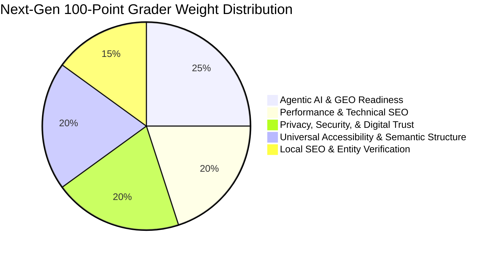

# Product Requirements Document (PRD): Next-Generation Website Grader

## 1. Executive Summary & Purpose

The purpose of the **Next-Generation Website Grader** is to evolve the current 53-check traditional SEO auditor into a forward-looking diagnostic engine. This grader will measure how well web assets communicate with both **human users** and **autonomous AI agents, RAG (Retrieval-Augmented Generation) pipelines, and conversational search engines (GEO — Generative Engine Optimization)**. 

Traditional search traffic is transitioning into the "Citation Economy." As users shift from clicking search results to asking conversational engines (like ChatGPT Search, Gemini, Perplexity, and Claude), websites must optimize for crawler access, content chunkability, token budgets, factual density, and semantic protocols.

This PRD establishes the roadmap for transforming our legacy codebase into a robust, high-value tool, broken into modular, bite-sized tasks. These tasks are structured so that autonomous subagents can complete them incrementally.

---

## 2. Current Architecture vs. Next-Gen Blueprint

### 2.1 The Current System
The current codebase is a command-line tool and Flask web application built in Python:
* **CLI Engine:** [grader.py](file:///home/stevengwonder/.openclaw/workspace/repos/website-grader/grader.py) orchestrates crawling, runs check suites, calls the scoring module, generates code fixes, and writes the report.
* **Crawler:** [crawler.py](file:///home/stevengwonder/.openclaw/workspace/repos/website-grader/crawler.py) crawls a site (homepage + up to `max_pages` key pages) using `curl_cffi` to mimic Google Chrome.
* **Checks Package:** Code under [checks/](file:///home/stevengwonder/.openclaw/workspace/repos/website-grader/checks) organizes diagnostics into 7 modules:
  * [technical.py](file:///home/stevengwonder/.openclaw/workspace/repos/website-grader/checks/technical.py) (Meta tags, heading hierarchy, canonicals, robots.txt, sitemaps, redirect chains, etc.)
  * [performance.py](file:///home/stevengwonder/.openclaw/workspace/repos/website-grader/checks/performance.py) (TTFB, page weight, compression, image attributes, minification ratio)
  * [local_seo.py](file:///home/stevengwonder/.openclaw/workspace/repos/website-grader/checks/local_seo.py) (NAP extraction, NAP consistency, LocalBusiness schema existence, map embeds)
  * [content.py](file:///home/stevengwonder/.openclaw/workspace/repos/website-grader/checks/content.py) (Word counts, keyword density, readability formulas, basic E-E-A-T keywords)
  * [security.py](file:///home/stevengwonder/.openclaw/workspace/repos/website-grader/checks/security.py) (HTTPS URL check, basic security header checks, mixed content scans)
  * [accessibility.py](file:///home/stevengwonder/.openclaw/workspace/repos/website-grader/checks/accessibility.py) (Alt tags, form labels, heading sequence, ARIA role presence)
  * [conversion.py](file:///home/stevengwonder/.openclaw/workspace/repos/website-grader/checks/conversion.py) (CTA detection, social links, analytics tracking tags)
* **Scoring Engine:** [scoring.py](file:///home/stevengwonder/.openclaw/workspace/repos/website-grader/scoring.py) calculates a weighted category average and an overall 0-100 score.
* **Fix Generator:** [fixes.py](file:///home/stevengwonder/.openclaw/workspace/repos/website-grader/fixes.py) creates copy-pasteable HTML and JSON snippets for common issues.
* **Report Builder:** [report.py](file:///home/stevengwonder/.openclaw/workspace/repos/website-grader/report.py) compiles results into a self-contained HTML report with CSS visual charts.

### 2.2 Crucial Gaps & Limitations
1. **Agentic AI & GEO Blindness:** The current suite fails to audit how AI crawlers (like OpenAI's `GPTBot` or Anthropic's `ClaudeBot`) are treated by the server. It lacks checks for standard AI directory descriptors (like `llms.txt`), does not track page token footprints, does not audit citation/factual density, and does not check for agentic transaction protocols (`/.well-known/agent-card.json`, MCP, ACP).
2. **Lab Data Performance Bias:** Performance metrics are measured from single-point-in-time requests (lab data) using raw request timings (TTFB, weight). It does not pull real-world field experience metrics (like Interaction to Next Paint - INP, LCP, or CLS) from real users via the Google Chrome UX Report (CrUX) API.
3. **Weak Structured Data Audits:** The Schema checks verify basic presence but ignore industry-specific categorization (e.g. `LegalService` vs. generic `LocalBusiness`), geo-coordinate decimal accuracy, opening hours schema formatting, and catalog relationships.
4. **Basic Security Scans:** Transport security is assessed by checking the URL scheme. It lacks real SSL/TLS handshake negotiation checks (verifying TLS 1.3 or testing for deprecated ciphers) and cookie flags validation.
5. **No AI/LLM Reporting:** There is no integration with large language models to generate personalized executive summaries, prioritized local SEO advice, or bespoke fixing scripts.

---

## 3. The New 100-Point Weighted Scoring Model

The next-generation scoring architecture will align the grader's scoring categories and weights directly to the 5 domains of generative engine optimization and modern user experience:

| Domain | Weight | Diagnostic Objectives | Key Metrics |
|---|---|---|---|
| **1. Agentic AI & GEO Readiness** | 25% | Crawler access, token sizes, citation optimization, and machine transactional capability. | `llms.txt` presence, AI bot rules parsing, Page token budget, Factual/citation density, /.well-known/agent-card.json presence. |
| **2. Performance & Technical SEO** | 20% | Core responsiveness, rendering architecture, and real user speed measurements. | CrUX API field metrics (INP, LCP, CLS), SSR raw markup access (no-JS crawl), compression (Brotli), HTTP/3 support. |
| **3. Privacy, Security & Digital Trust** | 20% | Encryption standards, HTTP headers, session cookie protection, and rate limiting. | TLS v1.3 configuration, CSP/HSTS/X-Frame headers, Cookie flags (HttpOnly/Secure/SameSite), WAF verification. |
| **4. Local SEO & Entity Verification** | 15% | Structured data precision, local packs matching, and multi-location schemas. | LocalBusiness subtype schema, 5-decimal coordinate accuracy, branchOf URLs, NAP GBP alignment. |
| **5. Accessibility & Semantic Structure** | 20% | Accessibility tree structure, keyboard controls, visual labels, and target footprints. | Semantic tag validators (no divs as buttons), ARIA bindings, skip links, image alt attributes, target size (>= 8x8px). |

---

## 4. Phased Implementation Roadmap for Subagents

To allow small, affordable agents to implement these upgrades step-by-step, the next-generation grader upgrades are broken down into six phases. Each phase is partitioned into distinct tasks.

### Phase 1: Agentic AI & GEO Diagnostics (Domain 1)
* **Goal:** Enable the grader to check for LLM scraper accessibility, token economics, and AI schemas.

#### Task 1.1: `llms.txt` Presence & Format Audit
* **Objective:** Scan the root directory for a structured sitemap-style `/llms.txt` file and audit its formatting.
* **Scope:** 
  * Check `/llms.txt` at the root domain.
  * Validate that the server returns a `200 OK` status and content type `text/plain` or `text/markdown`.
  * Verify that file size is within token limits (e.g. under 5,000 tokens) and check for common sections like `# Tools` or `# API Reference`.
* **Technical Requirements:** Write a check class `LlmsTxtCheck` inside a new check file `checks/agentic.py` (or [checks/technical.py](file:///home/stevengwonder/.openclaw/workspace/repos/website-grader/checks/technical.py)). Return a `CheckResult` with scoring: 100 for valid sitemap, 50 for raw txt, 0 for missing/5xx error.
* **Verification Criteria:** Run tests verifying `LlmsTxtCheck` on mock server responses.

#### Task 1.2: AI Crawler `robots.txt` Configuration Auditor
* **Objective:** Parse `robots.txt` allowed and blocked directives for major AI scraper user agents.
* **Scope:**
  * Parse [crawler.py](file:///home/stevengwonder/.openclaw/workspace/repos/website-grader/crawler.py)'s crawled `robots_txt`.
  * Search for user agents: `GPTBot`, `OAI-SearchBot`, `ClaudeBot`, `Claude-SearchBot`, `PerplexityBot`, `Google-Extended`, `Bytespider`.
  * Calculate an accessibility score: Deduct points if these crawlers are blocked (especially citation crawlers like `OAI-SearchBot` or `Claude-SearchBot`).
* **Technical Requirements:** Implement `AiCrawlerRobotsCheck`. Parse lines like `User-agent: GPTBot` and subsequent `Disallow:`.
* **Verification Criteria:** Test with various mock `robots.txt` strings (fully blocked vs. fully allowed).

#### Task 1.3: Page Token Budget Calculator
* **Objective:** Calculate the token footprint of each crawled page to ensure it fits in LLM context windows.
* **Scope:**
  * Implement a simple fallback tokenizer (or a standard library word-to-token estimator: ~1.3 tokens per word) to compute the token size of the raw HTML, main content text, and CSS/JS payloads.
  * Flag any page exceeding 30,000 tokens, API references exceeding 25,000 tokens, or conceptual guides exceeding 20,000 tokens.
* **Technical Requirements:** Implement `TokenBudgetCheck`. Calculate token length of `PageData.html` and `PageData.soup.get_text()`.
* **Verification Criteria:** Assert that pages with large scripts or text trigger a warning.

#### Task 1.4: Factual & Citation Density Auditor
* **Objective:** Analyze page text using natural language processing patterns to verify if the content is optimized for LLM search queries.
* **Scope:**
  * Scan for key citation signals:
    1. Numerical/statistical data (numbers, percentages).
    2. Named source attributions (e.g., "according to...", "reported by...").
    3. Direct expert quotations.
  * Penalize keyword-stuffed sections (frequency of keyword > 5%).
* **Technical Requirements:** Implement `CitationDensityCheck`. Use regex to match metrics and quotations. Check density score: targets are at least 3 statistical claims/expert quotes per 1,000 words.
* **Verification Criteria:** Run test assertions against pages with highly factual versus keyword-stuffed content.

#### Task 1.5: Agentic Transaction Protocols Scanner
* **Objective:** Scan the server root for machine-to-machine capabilities and agent protocols.
* **Scope:**
  * Request `/.well-known/agent-card.json` and verify its JSON structure.
  * Check HTML headers for Model Context Protocol (MCP) tool declarations or WebMCP headers.
  * Scan page markup for Stripe Agentic Commerce (ACP) or Shopify Universal Commerce (UCP) hooks.
* **Technical Requirements:** Implement `AgentProtocolCheck` which queries the JSON path and scans HTML schemas.
* **Verification Criteria:** Verify check returns `passed=True` when a valid mock `agent-card.json` is returned.

---

### Phase 2: Chrome UX Report (CrUX) Integration (Domain 2)
* **Goal:** Supplement local request timings with real-world user field data from the Google CrUX API.

#### Task 2.1: CrUX API Client Integration
* **Objective:** Create an API client in the crawler to query real user performance records for the domain.
* **Scope:**
  * Create a modular client in [crawler.py](file:///home/stevengwonder/.openclaw/workspace/repos/website-grader/crawler.py) to call the CrUX API endpoint `https://chromeuxreport.googleapis.com/v1/records:queryRecord`.
  * Accept an optional Google API Key parameter from environment variables (`GOOGLE_API_KEY`).
  * If no API key is present or if the domain has insufficient CrUX data, gracefully fall back to local "lab" measurements (while flagging the lack of field data).
* **Technical Requirements:** Fetch metrics: Interaction to Next Paint (INP), Largest Contentful Paint (LCP), and Cumulative Layout Shift (CLS).
* **Verification Criteria:** Mock API responses and assert parser maps JSON variables to class attributes.

#### Task 2.2: Core Responsive & Stability Auditing (INP, LCP, CLS)
* **Objective:** Incorporate field latency metrics into the grader scoring.
* **Scope:**
  * Create `CruxMetricsCheck` in [checks/performance.py](file:///home/stevengwonder/.openclaw/workspace/repos/website-grader/checks/performance.py).
  * Evaluate:
    * INP <= 200ms (Pass), >200ms and <=500ms (Needs Improvement), >500ms (Fail).
    * LCP <= 2.5s (Pass), >2.5s and <=4.0s (Needs Improvement), >4.0s (Fail).
    * CLS <= 0.10 (Pass), >0.10 and <=0.25 (Needs Improvement), >0.25 (Fail).
* **Technical Requirements:** Apply severities: INP (Critical, 6% of total score), LCP & CLS (High, 5% of total score).
* **Verification Criteria:** Assert score matches the evaluation bounds for good/poor ranges.

#### Task 2.3: SSR vs. Client-Side Rendering Audit
* **Objective:** Ensure crawlers that do not execute JavaScript can index the page text.
* **Scope:**
  * Compare the crawl payload fetched with `curl_cffi` (no-JS) against a simulated client-side app layout.
  * Scan for empty HTML shells (`

` or `

`) that contain no main text, indicating heavy reliance on client-side rendering (CSR).
  * Flag the site if critical textual content (above 200 words) is missing from the raw HTML code but present in sitemaps.
* **Technical Requirements:** Implement `SsrRenderingCheck`.
* **Verification Criteria:** Test against a mock SPA shell (empty body + scripts) to verify it fails the rendering check.

---

### Phase 3: Privacy, Security, & Digital Trust (Domain 3)
* **Goal:** Harden the security scans beyond header existence checks.

#### Task 3.1: Session Cookie Security Auditor
* **Objective:** Inspect cookies set by the website to ensure session identifiers are fully protected.
* **Scope:**
  * Extract all cookie headers (`Set-Cookie`) from homepage and redirect requests.
  * Check each cookie for the presence of three flags: `HttpOnly`, `Secure`, and `SameSite` (Lax or Strict).
  * Deduct points for any cookie missing `HttpOnly` (vulnerable to XSS extraction) or `Secure` (vulnerable to intercept).
* **Technical Requirements:** Write `CookieFlagsCheck` under [checks/security.py](file:///home/stevengwonder/.openclaw/workspace/repos/website-grader/checks/security.py).
* **Verification Criteria:** Verify cookie headers parsing with mock HTTP header structures.

#### Task 3.2: Modern SSL/TLS Handshake & HSTS Validator
* **Objective:** Query the server's SSL configuration to check for secure protocols and ciphers.
* **Scope:**
  * Perform a python `ssl` socket handshake with the target host.
  * Verify the negotiated TLS version: flag TLS 1.0 or 1.1 as failures; require TLS 1.3 for maximum score.
  * Read the response headers and verify that `Strict-Transport-Security` (HSTS) is configured with `max-age` of at least 1 year (31536000 seconds).
* **Technical Requirements:** Implement `TlsHandshakeCheck` utilizing the python `ssl` and `socket` libraries.
* **Verification Criteria:** Test socket handshake mocking on a local test environment or run against a local port.

---

### Phase 4: Structured Schema & GBP Verification (Domain 4)
* **Goal:** Ensure business entity verification aligns across the web.

#### Task 4.1: Specialized LocalBusiness Schema Auditor
* **Objective:** Parse JSON-LD structured data for precise micro-categorization and accurate configurations.
* **Scope:**
  * Look for specific subtypes of `LocalBusiness` (e.g., `PlumbingService`, `Dentist`, `LegalService`, `Restaurant`) instead of the base `LocalBusiness` tag.
  * Validate that coordinates (`geo.latitude`, `geo.longitude`) specify at least 5 decimal places of precision.
  * Verify that `openingHoursSpecification` opens and closes details conform to ISO 8601 formatting, including proper weekday arrays.
  * Confirm that service details map back to the provider entity.
* **Technical Requirements:** Update `_check_localbusiness_schema` in [checks/local_seo.py](file:///home/stevengwonder/.openclaw/workspace/repos/website-grader/checks/local_seo.py).
* **Verification Criteria:** Validate schema structures against standard examples.

#### Task 4.2: Location URL Routing & GBP Cross-Reference
* **Objective:** Check multi-location organization architectures and verify GBP mapping.
* **Scope:**
  * For multi-location businesses, verify that each location has a separate landing page.
  * Check that individual location pages link back to the main organization using the `branchOf` attribute in their schema.
  * (Optional API task): Query a mock/active GBP profile, comparing the spelling of the name, address formatting, and phone number against the page's schema markup.
* **Technical Requirements:** Implement `MultiLocationRoutingCheck` and `GbpNapAlignmentCheck`.
* **Verification Criteria:** Assert that schema with mismatched addresses flags errors.

---

### Phase 5: Accessibility Tree & Sizing Targets (Domain 5)
* **Goal:** Verify that visual layout code is accessible to visual and screen-reader AI bots.

#### Task 5.1: Semantic Controls vs. Styled Divs Auditor
* **Objective:** Audit the DOM to ensure interactive elements are semantic rather than generic.
* **Scope:**
  * Find `div` or `span` tags styled with CSS classes like `btn`, `button`, or `submit` that lack interactive roles.
  * Verify that all buttons use the `<button>` tag or have explicit `role="button"` and `tabindex` properties.
  * Scan heading trees to ensure that no levels are skipped (e.g. H1 followed directly by H3).
* **Technical Requirements:** Update [checks/accessibility.py](file:///home/stevengwonder/.openclaw/workspace/repos/website-grader/checks/accessibility.py) to parse tag relationships.
* **Verification Criteria:** Verify that a page with `
Click
` fails, while `<button>Click</button>` passes.

#### Task 5.2: Layout Stability & Interaction Targets Audit
* **Objective:** Scan the CSS and HTML configurations for stable action targets.
* **Scope:**
  * Check that all interactive target areas (links, buttons, input fields) maintain a visual layout footprint of at least 8x8 pixels (to assist AI vision agents).
  * Check that interactive elements have explicit cursor styling (`cursor: pointer` or similar).
  * Check image tags for `width` and `height` dimensions to prevent layout shifts.
* **Technical Requirements:** Write `LayoutStabilityCheck` in `checks/accessibility.py`.
* **Verification Criteria:** Assert validation errors are triggered on small targets or missing dimensions.

---

### Phase 6: Reporting & CLI Enhancements
* **Goal:** Integrate all new domains into the user interfaces and templates.

#### Task 6.1: CLI Terminal Interface Upgrade
* **Objective:** Update the CLI script to print the new 5-domain scores.
* **Scope:**
  * Update [grader.py](file:///home/stevengwonder/.openclaw/workspace/repos/website-grader/grader.py)'s text output routines.
  * Print each of the 5 next-gen domains, the number of checks run/passed, and their weighted contributions.
  * Color-code console outputs (Green for >= 80%, Yellow for 50-79%, Red for < 50%).
* **Technical Requirements:** Replace standard prints in `main()` with structured logging/printing functions.
* **Verification Criteria:** Run `grader.py` and inspect console outputs.

#### Task 6.2: Next-Gen HTML Report Template Update
* **Objective:** Revamp the report rendering code to display the new domains and metrics.
* **Scope:**
  * Update [report.py](file:///home/stevengwonder/.openclaw/workspace/repos/website-grader/report.py) and the inline HTML template.
  * Add a 5-bar visual chart representing the GEO and accessibility domains.
  * Display a dedicated card for "Agentic AI & GEO Readiness."
  * Group findings by the 5 new domains rather than the legacy 7 check categories.
* **Technical Requirements:** Re-arrange the HTML generation code. Ensure it continues to render a self-contained, Jinja-free single page.
* **Verification Criteria:** Generate a test report and open in a browser to inspect visual alignments.

---

## 5. Non-Functional & Operational Requirements

### 5.1 Technology Constraints
* **Dependency Minimization:** Core libraries must remain in Python's standard library or standard dependencies (`requests`, `beautifulsoup4`, `curl_cffi`, `flask`). Avoid heavy frameworks that cannot run in low-resource container environments.
* **Execution Performance:** The full site audit (hompage + 5 crawled pages) must execute in under 30 seconds.
* **Robust Failures:** If external API calls (such as CrUX or WHOIS) fail, the crawler must log the error, fallback to mock/lab metrics, and generate the rest of the report.

### 5.2 Agentic Hand-Off Protocols
* **Task Isolation:** Each task must be executable in its own branch.
* **Unit Tests:** Any check added must have a corresponding test function in the pytest suite.
* **Backward Compatibility:** CLI arguments (`--output`, `--json`, `--verbose`) must remain supported.
