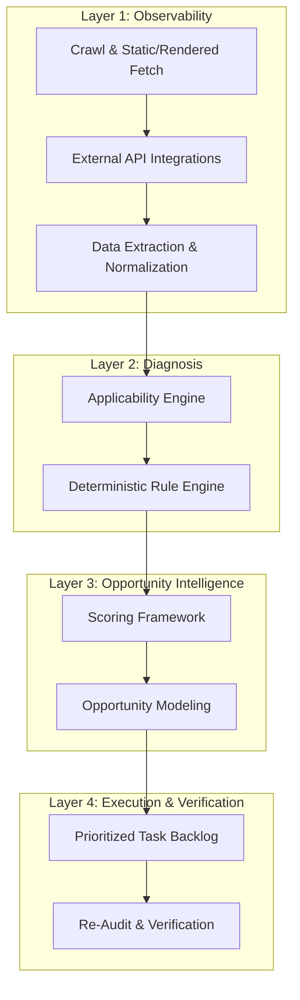

# Product Requirements Document (PRD): Website Intelligence Platform

## 1. Executive Summary & Purpose

The **Website Intelligence Platform** is the commercial evolution of our existing Python website grader. Instead of merely scanning a few pages to assign an arbitrary score, it operates as a trustworthy, evidence-led programmatic decision system for technical health, SEO, accessibility, digital trust, entity verification, AI-search/GEO discoverability, content opportunity, conversion readiness, and ongoing monitoring.

Traditional search is transitioning into the **Citation Economy**. As users shift from search engine result pages (SERPs) to generative search and conversational engines (ChatGPT Search, Google Gemini/SGE, Perplexity, Claude, etc.), websites must optimize for AI crawlers, chunkability, token economics, factual density, and semantic protocols.

This platform behaves like a **senior consultant supported by repeatable instrumentation**, not a checklist generator supported by optimism.

---

## 2. Core Architecture: The Four-Layer Framework

The platform is structured into four distinct functional layers to ensure modularity, repeatability, and testability:



### 2.1 Layer 1: Observability
* Collects immutable, deterministic facts about the website.
* Captures raw HTML, rendered DOM, network traces, console errors, response codes, and headers.
* Integrates external APIs (GSC, GA4, CrUX, Google Business Profile) as pluggable adapters.

### 2.2 Layer 2: Diagnosis
* Determines what is working, broken, missing, or contradictory.
* Executes rules based on page/site classifications.
* Restricts output states to: `PASS`, `FAIL`, `WARNING`, `NOT_APPLICABLE`, `UNVERIFIED`, `ERROR`, or `INFORMATIONAL`.

### 2.3 Layer 3: Opportunity Intelligence
* Translates technical findings into business relevance.
* Focuses on probable upside, search demand, conversion intent, prevalence, and feasibility.

### 2.4 Layer 4: Execution and Verification
* Generates developer/owner-specific instructions.
* Supports targeted re-auditing to verify issues have been resolved.

---

## 3. Existing Baseline Problems to Correct

Our baseline grader suffers from the following systemic defects which **must** be resolved in this platform:

1. **Site-Type Blindness:** Penalizes national SaaS or ecommerce sites for lacking Local SEO signals (such as map embeds or physical address schema). 
   * *Resolution:* Run local checks only after classifying the site type (e.g. Local storefront, Service-area business, National SaaS, etc.).
2. **Weak Business-Name Extraction:** Uses page titles as business names, creating false NAP (Name, Address, Phone) mismatch alerts.
   * *Resolution:* Cross-reference schema, meta tags, and footer info to evaluate name consistency.
3. **Sitemap Parsing Defects:** Fails to parse sitemap indexes, namespaces, compression, CDNs, or redirected sitemaps.
   * *Resolution:* Build a recursive parser that handles sitemap indexes and records retrieval details.
4. **HTTP-Status Misclassification:** Flags rate-limited or bot-blocked external links (e.g. 403 Forbidden) as broken.
   * *Resolution:* Reclassify as `access_restricted` or `unverified` rather than `broken`.
5. **Redirect-Count Confusion:** Labels any redirect as a "chain".
   * *Resolution:* Track hops; flag only when redirects are >1 hop.
6. **Generic Structured-Data Advice:** Merely counts JSON-LD scripts rather than parsing vocabulary correctness and checking Google rich-result feature eligibility.
7. **Outdated Content Advice:** Recommends FAQ schema as a guaranteed Google rich-result driver (which is now mostly deprecated by Google).
8. **Keyword-Density Mythology:** Flags fixed-percentage keyword density rather than semantic coverage, cannibalization, or repetitions.
9. **Readability Oversimplification:** Flags low readability text without considering audience intent, technical depth, or industry standards.
10. **Incomplete Accessibility Testing:** Counts empty attributes rather than evaluating keyboard focus, accessible names, and component-level grouping.

---

## 4. Modern Four-Pillar Scoring Model

To prevent hiding uncertainty inside a single arbitrary number, the platform will report four separate indicators:

### 4.1 Website Health
* Computed only from evaluated and **applicable** checks.
* *Values:* `PASS` = 1.0, `WARNING` = 0.5, `FAIL` = 0.0. `NOT_APPLICABLE`, `INFORMATIONAL`, and `ERROR` are excluded.
* *Formula:* 
  $$\text{Health Score} = \frac{\sum (\text{weight} \times \text{value})}{\sum (\text{weights of evaluated applicable checks})} \times 100$$

### 4.2 Audit Coverage
* Measures how much of the site was actually audited based on available data and integrations.
* Gaps (e.g., missing GSC, GA4, or CrUX API) reduce the coverage score rather than lowering the website health score.

### 4.3 Evidence Confidence
* Tells the user how sure the system is of its findings.
* Differentiates deterministic (e.g., HTTP 404) from inferred (e.g., AI-intent classification) observations.

### 4.4 Opportunity Potential
* Represents potential upside based on query impressions, conversion relevance, prevalence, and ease of fix.

---

## 5. Core Data Model

All system operations and findings are represented by versioned, immutable schema definitions:

* **AuditRun:** Metadata for the crawl (budgets, boundaries, versions, timestamps, crawl coverage).
* **SiteProfile:** Inferred characteristics (site type, business model, locations, CMS, overrides).
* **PageSnapshot:** Raw and rendered html hashes, headers, status codes, and word/token counts.
* **Finding:** Unique check results containing applicability checks, severity, scope, and evidence links.
* **Evidence:** Traceable, immutable evidence records (CSS selectors, HTTP traces, HTML chunks, JSON keys).
* **Recommendation:** Actionable code templates, owner roles, estimated effort, and validation check IDs.

---

## 6. 12-Phase Roadmap and Release Gates

```
Phase 0 ──> Phase 1 ──> Phase 2 ──> Phase 3 ──> Phase 4 ──> Phase 5
(Inventory) (Contracts) (Crawler)  (Scoring)   (Technical) (Perf/A11y)
                                                                 │
Phase 12 <── Phase 11 <── Phase 10 <── Phase 9 <── Phase 8 <── Phase 6/7
(Billing)   (Workflow)   (AI Layer)  (GSC/GA4)  (AI-Search) (Content/Local)
```

### 6.1 Roadmap Release Gates
* **Phase 0: Repository and Baseline Audit (Release Gate RG-0)**
  * Verify repository current structure, establish a frozen baseline fixture runner, and run regression tests.
* **Phase 1: Data Contracts and Evidence (Release Gate RG-1)**
  * Create schema models (Pydantic), evidence registries, and coverage metrics.
* **Phase 2: Crawl Correctness (Release Gate RG-2)**
  * Implement URL normalization, recursive sitemap indexing, and redirect tracking.
* **Phase 3: Applicability and Scoring (Release Gate RG-3)**
  * Site type classification (SaaS, Local storefront, Service-area business, Ecommerce) and applicability overrides.
* **Phase 4: Deterministic Technical Modules (Release Gate RG-4)**
  * Rebuild canonical, heading hierarchy, indexing, and structural schema validation.
* **Phase 5: Performance and Accessibility (Release Gate RG-5)**
  * Separate field data (CrUX) and lab data. Integrate custom accessibility and layout stability rules.
* **Phase 6: Content and Architecture (Release Gate RG-6)**
  * Main-content extraction, duplicate clustering, page-type inventory, and link graphs.
* **Phase 7: Local Module (Release Gate RG-7)**
  * Verify NAP consistency, location-page uniqueness, and Service-area business logics.
* **Phase 8: AI-Search Module (Release Gate RG-8)**
  * AI bot rules parsing, extractability metrics, and agent transaction cards.
* **Phase 9: First-Party Integrations (Release Gate RG-9)**
  * Connect GSC, GA4, and IndexNow to import actual search performance.
* **Phase 10: AI Interpretation (Release Gate RG-10)**
  * LLM-driven synthesis of deterministic findings, summaries, and gap audits.
* **Phase 11: Premium Report & Task Workflow (Release Gate RG-11)**
  * Implement verification loops, export task plans (CSV/Markdown), and compare re-audits.
* **Phase 12: Monitoring & Commercial Hardening (Release Gate RG-12)**
  * Schedules, alerts, usage metrics, retention limits, and multi-tenant accounts.

### 6.2 Release Gate RG-0 Checklist
RG-0 is complete only when:
1. `docs/current-state.md` exists.
2. `docs/current-check-catalog.md` exists.
3. `docs/current-data-flow.md` exists.
4. `docs/current-output-contract.md` exists.
5. Existing entry points are documented.
6. Existing check files are cataloged.
7. Current scoring formula is documented.
8. Current report schema is documented.
9. SEO.com baseline audit can run from frozen fixtures without network calls.
10. Known-defect regression tests exist.
11. Known-defect tests either fail against current behavior or are marked expected-fail with a reason.
12. ADR files exist for evidence-first (`docs/adr/001-evidence-first.md`), applicability-aware scoring (`docs/adr/002-applicability-aware-scoring.md`), static/rendered crawling (`docs/adr/003-static-and-rendered-crawling.md`), and AI-as-interpretation-layer (`docs/adr/004-ai-as-interpretation-layer.md`).
13. Pydantic schema file exists (`models.py`).
14. Schema validation tests exist.
15. A legacy-to-v2 serializer or migration stub exists.
16. No production audit logic has been modified except where needed to make the fixture runner possible.

**Do not proceed beyond WG-006 until RG-0 is demonstrated.**

---

## 7. Comprehensive Task Backlog (WG-001 to WG-080)

### Foundation (Phase 0)

#### WG-001: Inventory the repository.
* **Objective:** Document entry points, existing checks, scoring formulas, data flows, and current test coverage. Do not change production logic.

#### WG-002: Reproduce the current SEO.com audit from a frozen fixture.
* **Objective:** Create a frozen mock response/HTML dataset for `seo.com` so we can run regression checks deterministically.
* **Requirements:** The fixture must contain:
  1. `manifest.json` mapping URLs to mock files.
  2. The original five crawled URLs.
  3. Raw HTML fixture per URL.
  4. Rendered DOM fixture per URL if available, or explicit unavailable marker.
  5. HTTP status and headers per URL.
  6. Redirect traces.
  7. Robots.txt response fixture.
  8. Sitemap candidate response fixtures.
  9. External G2 `403` response fixture.
  10. Expected legacy audit JSON.
  11. Expected current HTML report if generated.
  12. Test helper that runs the current engine without live network access.

#### WG-003: Create known-defect regression tests.
* **Objective:** Create tests proving current system bugs before fixing them.
* **Defect List:**
  1. Sitemap index or invalid sitemap endpoint reported as "0 URLs" instead of accurately classified.
  2. External `403 Forbidden` classified as a broken link instead of access-restricted or unverified.
  3. A single-hop redirect classified as a redirect chain.
  4. Business name extracted solely from the `<title>` tag, creating false NAP mismatch.
  5. National, SaaS, ecommerce, or non-local website penalized with Local SEO zero.
  6. Obsolete FAQ schema advice presented as a Google rich-result opportunity.
  7. Structured-data audit counts JSON-LD script blocks instead of parsing entities, `@graph`, and supported feature eligibility.
  8. Keyword-density fixed-percentage rule flags repetition without excluding boilerplate, nav, footer, or brand/service context.
  9. Readability score treated as a failure without page-type, audience, industry, or text-region context.
  10. Accessibility tests count missing attributes instead of computed accessible names, valid labels, landmarks, focus behavior, and component-level grouping.
  11. Unsafe generated fix code produces fictional addresses, phone numbers, ratings, review counts, map coordinates, or business hours.

#### WG-004: Create Architecture Decision Records (ADRs).
* **Objective:** Create documents for evidence-first execution, applicability scoring, static vs rendered crawling, and AI integration boundaries.

#### WG-005: Create Pydantic output models.
* **Objective:** Evolve data contracts with versioned, robust Pydantic schemas.
* **Requirements:**
  * Create models for: `AuditRun`, `SiteProfile`, `PageSnapshot`, `Evidence`, `Finding`, `Recommendation`, `ScoreSummary`, `LegacyAuditReport`, and `MigrationResult`.
  * Use `schema_version = "2.0.0"`.
  * Use `Field(default_factory=...)` for timestamps, IDs, and lists.
  * Do not use mutable defaults like `[]` or list defaults directly.
  * Do not use `datetime.utcnow()` directly as a default value (use a callable factory instead).

#### WG-006: Add schema migration support.
* **Objective:** Implement a serializer to translate legacy output objects to version `2.0.0` outputs.

---

### Phase 1 to 12 backlogs (WG-007 to WG-080)
*(Note: These tasks represent future scope and must not be implemented during Phase 0 execution. The next agent may ONLY execute tasks WG-001 through WG-006.)*

* **WG-007** through **WG-080** cover: Evidence Registry, Crawl Correctness, Heuristics/Applicability engines, Technical audits, Performance and Accessibility (Lighthouse/axe-core), Content graphs, Local SEO updates, GEO/AI crawlers, Integrations (GSC, GA4, IndexNow), AI summary synthese, Reporting panels, and Multi-tenant schedules.

---

## 8. Definition of Done (DoD) for Tasks

A backlog task is complete only when:
1. **Code:** The requested feature/logic is fully implemented.
2. **Tests:** Unit tests and integration tests exist and pass.
3. **Compatibility:** Existing compatibility checks pass. No regression.
4. **Data Models:** Versioned Pydantic schemas are updated and used.
5. **Errors & Logs:** Graceful exception handling and telemetry logging are present.
6. **Evidence & Truth:** Finding data links to traceable, immutable evidence.
7. **Documentation:** Relevant README or implementation guides are updated.
8. **Minimal Refactoring:** Unrelated broad codebase refactoring is avoided (aligns with *Ponytail dev mode*).

---

## 9. Ponytail Dev Mode Constraints

Every implementation step must run under the **Ponytail (lazy senior dev mode)** rules:
* **No over-engineering:** Do not add complex abstraction directories or databases unless explicitly required by the active phase.
* **Standard library first:** Prefer Python builtins over adding new dependencies.
* **Fewer files:** Keep check implementations aggregated in logical files (e.g. keep check modules inside `checks/`) rather than creating a separate file for every rule.
* **Verification:** Write the smallest possible check script/tests to verify logic before merging.
* **Strict Foundation:** Ponytail mode must never be used as an excuse to skip evidence, tests, data contracts, compatibility, or release gates. Keep the code simple, but keep the truth layer strict.

---

## 10. Prevention of Scope Creep (Phase 0 Constraints)

The next coding agent may **only** execute **WG-001 through WG-006**. It is strictly forbidden from implementing:
* New SEO checks
* New scoring formulas
* Playwright browser rendering
* Lighthouse integrations
* axe-core accessibility runners
* Google Search Console (GSC) or GA4 adapters
* AI search/GEO visibility checks
* Local SEO category rewrites
* Report UI visual redesigns
* Multi-tenant or billing architectures

*The next agent is building the foundation, not the cathedral. Humans already tried tower-building once and it produced JavaScript frameworks.*
