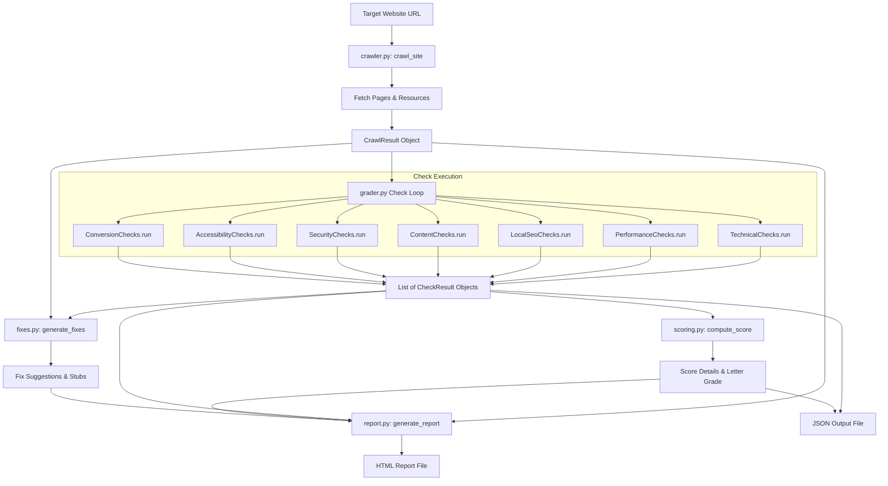

# Current Data Flow

This document details the data lifecycle and execution pipeline of the Website Grader, mapping how raw network responses translate into scores and HTML/JSON reports.

## 1. Flow Diagram

---

## 2. Step-by-Step Data Flow

### 1. crawling & Fetching (`crawler.py`)
- **Input:** Target URL.
- **Process:**
  - Standardizes the URL schema (prepends `https://` if missing).
  - Fetches the homepage and extracts all internal links.
  - Prioritizes crawling URLs matching semantic priority paths (e.g. `/contact`, `/about`, `/services`, etc.).
  - Crawls recursively up to `max_pages` (default: 5) using `curl_cffi.requests.Session`.
  - Fetches robots.txt and sitemap.xml.
- **Output:** A `CrawlResult` dataclass object holding base domain, sitemap URL list, robots.txt contents, and a dictionary of `PageData` objects (which contain raw HTML, status codes, response headers, parsed BeautifulSoup structures, and TTFB latency).

### 2. Diagnosis & Check Validation (`checks/`)
- **Input:** `CrawlResult` object.
- **Process:**
  - Iterates over all registered categories retrieved from `_load_categories()`.
  - Instantiates each `CheckCategory` class.
  - Invokes `checker.run(crawl_result)`.
  - Checkers scan the parsed `BeautifulSoup` structures or network statistics to evaluate success criteria.
- **Output:** Flat list of `CheckResult` objects.

### 3. Scoring Heuristic (`scoring.py`)
- **Input:** Flat list of `CheckResult` objects.
- **Process:**
  - Aggregates results by category.
  - For each category, computes a weighted average of individual tests based on `Severity` weight factors:
    - `CRITICAL`: 4
    - `HIGH`: 3
    - `MEDIUM`: 2
    - `LOW`: 1
    - `INFO`: 0.5
  - Computes the overall grade by applying hardcoded category weights to the active category scores.
- **Output:** Dict containing overall score, letter grade (A-F), and categorical stats.

### 4. Recommendation Generation (`fixes.py`)
- **Input:** `CrawlResult` and list of `CheckResult` objects.
- **Process:**
  - Matches failed checks to static code templates or guidelines.
  - Suggests specific actions based on crawled findings.
- **Output:** Dict mapping check IDs to repair guides.

### 5. Serialization & Report Compiling (`report.py` / `grader.py`)
- **Input:** Combined crawl results, findings, scores, and fixes.
- **Process:**
  - Builds final HTML report via Jinja-like templates or raw string substitution.
  - Optionally parses a structured JSON dictionary for export.
- **Output:** Production of `report.html` and/or user-specified JSON file.
